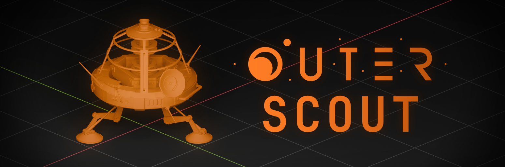

# Outer Scout

A toolbox for creating and importing cinematic shots from Outer Wilds into Blender!

## Features

To be more percise, this mod implements the [HTTP API](OuterScout.WebApi/resources/openapi.yaml) that can:
- Create one or more cameras (even [360](OuterScout.WebApi/resources/openapi.yaml#L267)!)
- Animate their movement using [keyframes](OuterScout.WebApi/resources/openapi.yaml#L370)
- Create [recorders](OuterScout.WebApi/resources/openapi.yaml#L420) of their RenderTextures (color and depth are supported)
- [Record](OuterScout.WebApi/resources/openapi.yaml#L119) your scene with a fixed frame rate

This API is used by a separate add-on for Blender, which allows you to define camera movement using keyframes. For more information, check out the [add-on repository](https://github.com/Picalines/outer-scout-blender)!